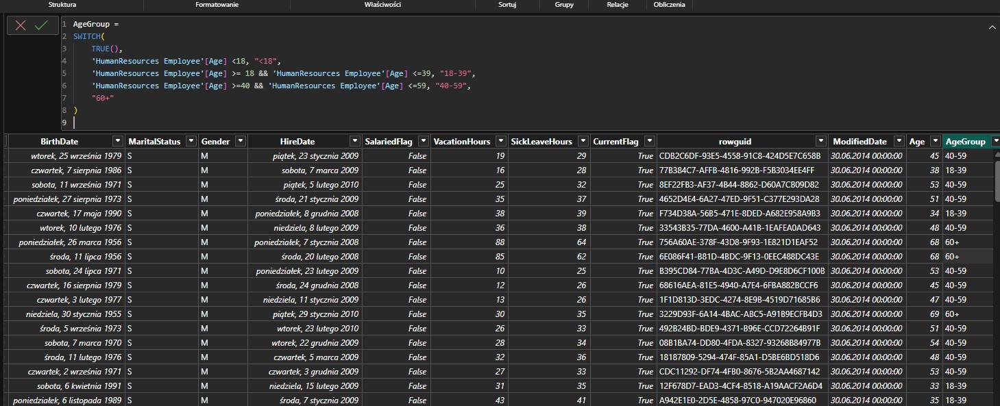

## Introduction

The aim of this project is to practice SQL queries and their usage with <b>Power BI</b> dashboards.
The data used in this project is imported from the sample AdventureWorks database.

### Adding measures in AdventureWorks tables

- I've added a new columns into the <b>HumanResources Employee</b> table in order to calculate the age of each employee using DAX formulas:

```
Age = DATEDIFF('HumanResources Employee'[BirthDate], TODAY(),YEAR)
```

- Based on the Age column, I would like to group employees into age range:

```
AgeGroup =
SWITCH(
    TRUE(),
    'HumanResources Employee'[Age] <18, "<18",
    'HumanResources Employee'[Age] >= 18 && 'HumanResources Employee'[Age] <=39, "18-39",
    'HumanResources Employee'[Age] >=40 && 'HumanResources Employee'[Age] <=59, "40-59",
    "60+"
)
```

<b>Output:</b>

